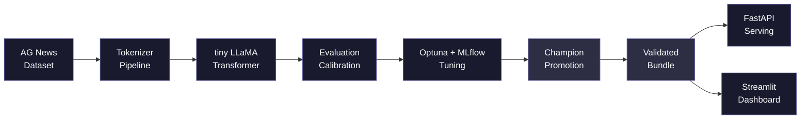

<p align="center">
  <h1>BayesOptGPT</h1>
</p>

<p align="center">
  An end-to-end NLP classification system for AG News featuring a custom tiny LLaMA-inspired transformer, uncertainty-aware evaluation, Optuna + MLflow hyperparameter tuning, champion promotion, validated model bundles, FastAPI serving, and a Streamlit dashboard.
</p>

---

<p align="center">
  
  
  
  
  
  
  
  
  
</p>

---

<p align="center">
  <a href="https://bayesoptgpt.streamlit.app/#llm-calibration-and-evaluation-dashboard"><strong>Live Dashboard</strong></a> ·
  <a href="#quickstart">Quickstart</a> ·
  <a href="#architecture">Architecture</a> ·
  <a href="#performance">Performance</a> ·
  <a href="#features">Features</a> ·
  <a href="#deployment">Deployment</a>
</p>

---

## Executive Summary

BayesOptGPT is a production-ready NLP classification system built around a custom tiny LLaMA-inspired transformer. It delivers accurate, well-calibrated predictions on the AG News dataset with full uncertainty quantification and end-to-end experiment tracking.

What makes it distinctive:

- **Custom LLaMA-inspired transformer** — compact classifier with RMSNorm, RoPE attention, and SwiGLU activation blocks
- **Uncertainty-aware evaluation** —ECE, Brier score, confidence distributions, and entropy analysis
- **Optuna + MLflow tuning** — automated hyperparameter optimization with complete experiment tracking
- **Champion promotion** — deterministic model selection with manifest-backed bundling and SHA-256 checksums
- **Bundle-driven serving** — FastAPI runtime loads strictly from validated, checksum-verified model artifacts
- **Full dashboard stack** — Streamlit UI with visualizations, calibration plots, and live inference

This is a complete engineering product: data pipeline through serving, all config-driven, with Docker and Hugging Face Spaces deployment assets ready.

---

## Performance

Full-split AG News evaluation results from the config-driven training/evaluation stack:

### Validation Split

| Metric | Value |
|---|---:|
| Accuracy | **0.9258** |
| Macro F1 | **0.9256** |
| NLL / Loss | **0.2344** |
| Brier Score | **0.1152** |
| ECE | **0.0317** |

### Test Split

| Metric | Value |
|---|---:|
| Accuracy | **0.9271** |
| Macro F1 | **0.9271** |
| NLL / Loss | **0.2479** |
| Brier Score | **0.1163** |
| ECE | **0.0323** |

**Per-class Test F1:**
- World: 0.9342
- Sports: 0.9776
- Business: 0.8950
- Sci/Tech: 0.9014

These full-split results demonstrate strong generalization with stable validation/test alignment (Δ accuracy < 0.2%). Calibration is excellent (ECE ≈ 3.2%), indicating well-calibrated confidence estimates. Sports classification is strongest; Business and Sci/Tech form the most confusable pair.

---

## Architecture



| Stage | Description |
|---|---|
| Data | AG News via HuggingFace `datasets` + local tokenizer artifacts |
| Model | Custom compact transformer (RMSNorm, RoPE, SwiGLU) |
| Evaluation | Full-split metrics, calibration diagnostics, uncertainty plots |
| Tuning | Optuna study with MLflow tracking |
| Promotion | Champion selection + manifest-backed bundle with checksums |
| Serving | FastAPI runtime loading from validated bundle |
| Dashboard | Streamlit UI for visualizations and live inference |

---

## Features

### Custom Model Architecture
Compact transformer classifier inspired by LLaMA design principles:
- **RMSNorm** — root-mean-square layer normalization for training stability
- **RoPE** (Rotary Position Embedding) — position-aware attention without absolute embeddings
- **SwiGLU** — gated linear unit activation for improved expressiveness
- Config-driven: embedding dimension, layer count, attention heads, FFN dimension

### Evaluation, Uncertainty & Calibration
Comprehensive evaluation with full uncertainty quantification:
- Standard metrics: accuracy, macro F1, negative log-likelihood, Brier score
- Calibration diagnostics: Expected Calibration Error (ECE), reliability diagrams
- Uncertainty summaries: confidence distributions, entropy analysis
- Per-class F1 breakdown and confusion analysis
- Plot exports: calibration curves, reliability diagrams, confidence/entropy histograms

### Tuning & Experiment Tracking
Automated hyperparameter optimization:
- **Optuna** study with pruning, multi-parameter search space
- **MLflow** tracking for all trials, metrics, parameters, and artifacts
- Deterministic champion selection based on configured objective

### Model Promotion & Bundle Packaging
Reproducible artifact management:
- Champion promotion from Optuna study
- Bundle generation: checkpoint, tokenizer, configs, manifest, checksums
- SHA-256 integrity verification
- Provenance metadata for full auditability

### Serving & Dashboard
Production-ready deployment:
- **FastAPI** runtime loads strictly from validated bundle
- Startup validation of all required files and checksums
- **Streamlit** dashboard with tabs:
  - Overview — summary statistics
  - Results — full-split metrics tables
  - Visualizations — confusion matrix, reliability diagrams
  - Calibration & Uncertainty — confidence, entropy analysis
  - Live Inference — interactive prediction
  - Model Metadata — bundle info, label map
- Docker + Hugging Face Spaces aligned to port `7860`

---

## Quickstart

```bash
# Install dependencies
uv lock
uv sync --all-groups

# Download data and tokenizer
uv run python scripts/download_data.py --config configs/data.yaml

# Train the model
uv run python scripts/train.py --data-config configs/data.yaml --model-config configs/model.yaml --train-config configs/train.yaml

# Evaluate and calibrate
uv run python scripts/evaluate.py --data-config configs/data.yaml --model-config configs/model.yaml --train-config configs/train.yaml
```

---

## End-to-end Workflow

```bash
# 1. Download data + tokenizer artifacts
uv run python scripts/download_data.py --config configs/data.yaml

# 2. Train the model
uv run python scripts/train.py --data-config configs/data.yaml --model-config configs/model.yaml --train-config configs/train.yaml

# 3. Evaluate + calibrate
uv run python scripts/evaluate.py --data-config configs/data.yaml --model-config configs/model.yaml --train-config configs/train.yaml

# 4. Tune with Optuna + MLflow
uv run python scripts/tune.py --data-config configs/data.yaml --model-config configs/model.yaml --train-config configs/train.yaml --tune-config configs/tune.yaml
uv run mlflow ui --backend-store-uri sqlite:///mlflow.db

# 5. Promote champion bundle
uv run python scripts/promote.py --tuning-dir artifacts/tuning --output-dir artifacts/model/bundle --tokenizer-dir artifacts/tokenizer

# 6. Validate bundle integrity
uv run python scripts/validate_bundle.py --bundle-dir artifacts/model/bundle

# 7. Serve from bundle
uv run python scripts/serve.py --config configs/serving.yaml

# 8. Launch dashboard
uv run streamlit run streamlit_app.py
```

---

## Artifact Layout

| Output | Location |
|---|---|
| Tokenizer artifacts | `artifacts/tokenizer/` |
| Model checkpoints | `artifacts/checkpoints/` |
| Evaluation outputs | `artifacts/evaluation/` |
| Full-run evaluation | `artifacts/evaluation_full_run/` |
| Tuning outputs | `artifacts/tuning/` |
| Promoted bundle | `artifacts/model/bundle/` |

---

## Repository Structure

| Path | Description |
|---|---|
| `configs/` | Configuration files (data, model, training, tuning, serving) |
| `scripts/` | End-to-end pipeline scripts (download, train, evaluate, tune, promote, serve) |
| `src/bayes_gp_llmops/` | Core package: model, data, evaluation, tuning, serving modules |
| `artifacts/` | Generated outputs: tokenizer, checkpoints, evaluation, tuning, bundles |
| `docs/` | Additional documentation |
| `streamlit_app.py` | Streamlit dashboard application |
| `Dockerfile` | FastAPI serving container |
| `Dockerfile.streamlit` | Streamlit dashboard container |

---

## Deployment

### FastAPI Serving

```bash
uv run python scripts/serve.py --config configs/serving.yaml
```

### Streamlit Dashboard

```bash
uv run streamlit run streamlit_app.py
```

### Docker

```bash
docker build -t bayesoptgpt:latest .
docker run --rm -p 7860:7860 -e SERVING_BUNDLE_DIR=/app/artifacts/model/bundle -v "${PWD}/artifacts/model/bundle:/app/artifacts/model/bundle:ro" bayesoptgpt:latest
```

### Hugging Face Spaces / Streamlit Community Cloud

1. Push repository to GitHub with dashboard artifacts.
2. Create new app in Streamlit Community Cloud.
3. Set main file path to `streamlit_app.py`.
4. Configure optional secrets/environment variables as needed.
5. Deploy.

Requires: `uv`, Python 3.12, port `7860`.

---

## Screenshots

Screenshots will be committed here when available.

| Section | Description |
|---|---|
| Dashboard Overview | Main dashboard landing with summary statistics |
| Confusion Matrix | Per-class confusion visualization |
| Reliability Diagram | Calibration curve with confidence bins |
| FastAPI `/docs` | API documentation and interactive endpoints |
| MLflow UI | Experiment tracking dashboard (optional) |

To add screenshots:
1. Capture outputs from evaluation runs and serving
2. Add to repository (e.g., `docs/screenshots/`)
3. Reference here with descriptive alt text

---

## Operational Notes

- The repository is validated end-to-end in local development (download, train, evaluate, tune, promote, validate bundle, serve).
- Deployment assets (Docker, Hugging Face Spaces) are prepared and aligned with the bundle-driven runtime.
- **Large-scale latency/load benchmarking is not yet included** — add before high-throughput production rollout.
- This is a mature development-time system; validate thoroughly before production use.

---

## Related Docs

- `docs/README.md`
- `docs/serving_hf_spaces.md`
- `docs/streamlit_dashboard.md`

---

## License

MIT License — see `LICENSE` file for details.